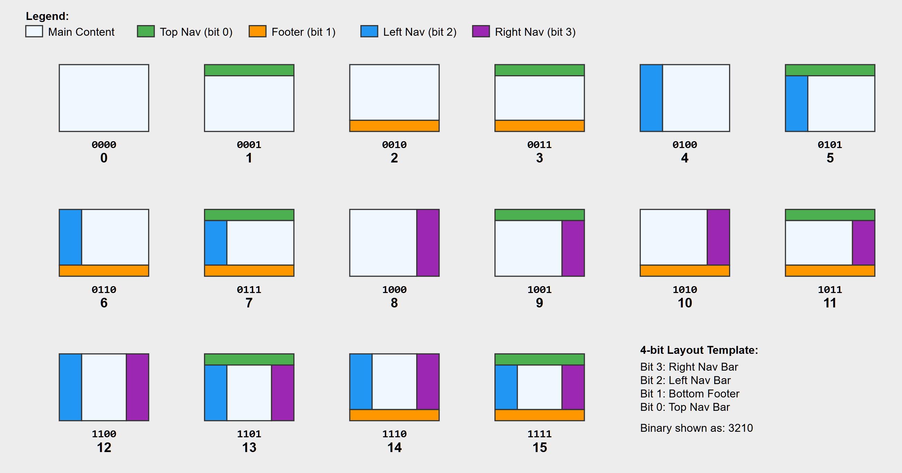
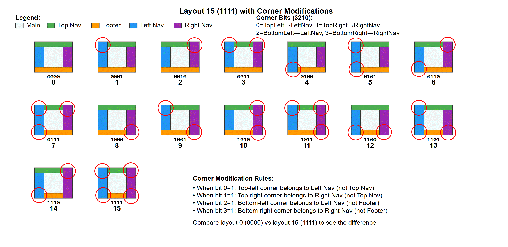

# Styles
Styles consist of pre-defined groups of bytes. Each bit in the byte group may have a different meaning. This makes it neccessary to define the byte groups and their meanings. There are different groups of styles including background layer, container/panels, and the ones for the content of the panels including text, forms, images, tables, frames, nav bars, etc.

## Page Layout Style






### **3.1. Layout Definition**

The first byte of the file defines which of the 255 predefined layouts to use. Each layout specifies the arrangement of content panes (e.g., header, main, footer) and has both a desktop and a mobile rendering mode.

* **Data Type:** 1 byte  
* **Example:** 0x03 selects Layout \#3 (e.g., Header, Navbar, Main, Footer).

# Figuring out the templates
There are 256 templates. All the templates have a "Main" section. Template 0 is just a main section. 
The byte of the templates is a bit field:

Template Types
bit | meaning
---|---
0 | Side to Side Heading exists
1 | Side to Side Footer exists
2 | Top to Bottom Left Aside exists
3 | Top to Bottom Right Aside exists
4, 5 | How many columns exist (1 to 4) 00=1 01=2 11=3
6, 7 | How many rows exist (1 to 4) 00=1 01=2 11=3

Container Types (For Phase II or QWeb)
bit | meaning
---|---
0 | Side to Side Heading exists
1 | Side to Side Footer exists
2 | Top to Bottom Left Aside exists
3 | Top to Bottom Right Aside exists
4, 5 | How many columns exist (1 to 4) 
6, 7 | How many rows exist (1 to 4) 


## Panel/Backgroud-Layer Styling

First byte is the includes bigfield. 

Bit Index | Name | Meaning
---|---|---
0  | Has BG Color | Is there a background color section?  false means transparent
1  | Has a background image |  Is there an image section
2  | Does it have a two color gradient?  |  Does it use a gradiant with two colors?
3  | Does it have a three color gradient?  |  Does it use a gradiant with four colors?
4  | Does it have a four color gradient?  |  Does it use a gradiant with four colors?  
5  | Is it animated?  | Does the background contain animation? 
6  | Does the background have events?  |  Does the background react to events and switch styles? 
7  | Can the user set the style? | Can the user's browser set the style

The order of the bytes that follow depend on the bitfield above. 


Name | bytes | meaning 
---|---|---
BG Color | 2 | up to 65K colors
BG Image | 16 |


### **3.2. Style Table**

This table defines the visual styles used in the document.

* **Structure:** A count byte followed by a series of 6-byte style records.  
* **Style Record (6 bytes / 48 bits):**  
  * **font-family (6 bits):** ID for up to 64 predefined fonts.  
  * **font-size (7 bits):** Size in points (1-127pt).  
  * **flags (3 bits):** Bitmask for Bold, Italic, and Underline.  
  * **text-color (16 bits):** 16-bit "HighColor" (R5G6B5).  
  * **bg-color (16 bits):** 16-bit "HighColor" (R5G6B5).


Index Number |Name  | bytes/bits | Meaning
---|---|---|---
0 | Style Start Code      | 1      | (ASCII Non-printable characters are allowed) When this code is encoutered in the subject line, the following style will kick in. 
1 | font-family           | 1      | 0-255. See font table. 0 means download font from raida. Only one allowed
2 | color                 | 2      | 65K different colors
4 | background-color      | 2      | 65K different colors
5.0 | font-weight         | 2 bits | 0=normal, 1=light, 2= bold, 3 = ?
5.2| font-style           | 2 bits | 0=normal, 1=italic, 2=oblique
5.4 | text-decoration-line| 2 bits | 0=none, 1=underline, 2=overline, 3=line-through
5.6 | direction           | 2 bits | 0= Left Right, 1=Right Left, 2=Top Bottom, 3=Bottom Top
5.8| Style End Code       | 1      | (ASCII Non-printable characters are allowed) Puts the Style back into the last style. 

# Qmail File Format

This is the actual qmail file. It uses the CBD (Compace Binary Document) format.

# Fixed part of file (Phase I)

```c
Sample file

Meta Data File 
FS VS // Start of Lookup Table, Version
  Will use the client's default five styles
FS VS TC // Start of marked up text, VS Template code
  STX // STX means Start of text
```

Code | Bytes | Name & Description | Required?
---|---|---|---
0 | 1 | Number of Key Pairs | Required 
1 | 1 | version / formatting type | 0=plain text, 1 = Formatted Qmail CBD file (0 for Phase I| Required 
2 | varies | Plain Text Message. Only used if version = 0. The actuall text of the message UTF-8 | Required 

Phase I just has plain text messages. 

Sample Qmail CBD File (13 bytes total):
```javascript
0x00 0x01 0x03 // Key: Number of key pairs, Length of Value: one byte, Value: Three key pairs
0x01 0x01 0x00  // Key: Version, Length of Value: one byte, Value: Version 0
0x02 0x0B 0x48 0x65 0x6c 0x6c 0x6f 0x20 0x57 0x6f 0x72 0x6c 0x64   // Key: Message, Length of Value: 11, Value: Hello world
```
Qmail CBD File Shown as a Table:

Key | Length of Value | Value
---|---|---
0x00 | 0x01 | 0x03 
0x01 | 0x01 | 0x00  
0x02 | 0x0B | 0x48 0x65 0x6c 0x6c 0x6f 0x20 0x57 0x6f 0x72 0x6c 0x64  


# Fixed part of file (Phase II)
The Phase II version of the file includes formatting options. This is achieved by adding lookup tables and then a marked up text file. 

To mark up the the text and create the lookup tables, the first 32 ASCII characters (Control Characters) are used. Here are these characters:

# First 32 ASCII Characters (Control Characters)

| Index | Hex | Symbol | Description | New Use |
|-------|-----|---------|-------------|------------|
| 0 | 00 | NUL | *Null character | ?
| 1 | 01 | SOH | Start of Heading | Status |
| 2 | 02 | STX | Start of Text | Same
| 3 | 03 | ETX | End of Text | Same
| 4 | 04 | EOT | End of Transmission | End
| 5 | 05 | ENQ | Enquiry | ?
| 6 | 06 | ACK | Acknowledgment | ?
| 7 | 07 | BEL | Bell (Alert) | Alert
| 8 | 08 | BS | Backspace | ?
| 9 | 09 | HT | *Horizontal Tab | Tab
| 10 | 0A | LF | *Line Feed | Line Break (Unix)
| 11 | 0B | VT | Vertical Tab | Paragraph?
| 12 | 0C | FF | Form Feed | ?
| 13 | 0D | CR | *Carriage Return | Line Break (Windows)
| 14 | 0E | SO | Shift Out | ?
| 15 | 0F | SI | Shift In | ?
| 16 | 10 | DLE | Data Link Escape | ?
| 17 | 11 | DC1 | Device Control 1 (XON) | ?
| 18 | 12 | DC2 | Device Control 2 | ?
| 19 | 13 | DC3 | Device Control 3 (XOFF) | ?
| 20 | 14 | DC4 | Device Control 4 | ?
| 21 | 15 | NAK | Negative Acknowledgment | ?
| 22 | 16 | SYN | Synchronous Idle | ?
| 23 | 17 | ETB | End of Transmission Block |
| 24 | 18 | CAN | Cancel | ?
| 25 | 19 | EM | End of Medium | ?
| 26 | 1A | SUB | Substitute | ?
| 27 | 1B | ESC | *Escape | ?
| 28 | 1C | FS | File Separator | Same
| 29 | 1D | GS | Group Separator | Same
| 30 | 1E | RS | Record Separator | Same
| 31 | 1F | US | Unit Separator | Same


## Layout of a Qmail File
This shows how an entire Qmail file will be laid out. 
It uses control characters to lay things out so that byte heavy html is not needed.
```c
Meta Data
 
FS VS // Start of Lookup Table, Version
	GS 01 // Container Background Formats 
		RS 01 ##### // Format ID number 1 and then five bytes 
		RS 02 #####
		RS 03 #####
	GS 02 // Container Spacing Formats 
		RS 01 ###### // Format ID number 1 and then five bytes 
		RS 02 ######
		RS 03 ######
	GS 03 // Container Border Formats 
		RS 01 ######## // Format ID number 1 and then five bytes 
		RS 02 ########
		RS 03 ########
	GS 04 // Container Shadow Formats 
		RS 01 ##### // Format ID number 1 and then five bytes 
		RS 02 #####
		RS 03 #####
  GS 05 // Container Advanced Background Image Format
		RS 01 ##### // Format ID number 1 and then five bytes 
		RS 02 #####
	GS 06 // Text Formats 
		RS 01 ######## // Format ID number 1 and then five bytes 
		RS 02 ########
		RS 03 ########
	GS 07 // Table Formats
	GS 08 // Image Formats
	GS 09 // List Formats

FS VS TC // Start of marked up text, VS Template code
	GS 01 CT MR MC NS W% H% TXT // Main Container, Container Type, Max Rows, Max Columns, Number of Spaces, Width, Height, Include if Text file only. 
		RS 01 TL BR  // Space 1, Top Left Grid, Bottom Right Grid
			I'm a bunch of BDtextBD that can be marked up. 
		RS 02 TL BR  // Space 1, Top Left Grid, Bottom Right Grid
		RS 03 TL BR  // Space 1, Top Left Grid, Bottom Right Grid
		RS 04 TL BR  // Space 1, Top Left Grid, Bottom Right Grid
	GS 02 Header
	GS 03 Footer
	GS 05 Left Align
	GS 06 Right Align
	GS 07 Popup


```


Code | Bytes | Name & Description | Required?
---|---|---|---
0 | 1 | Number of Key Pairs | Required 
1 | 1 | version / formatting type | 0=plain text, 1 = Formatted Qmail CBD file (0 for Phase I| Required 
2 | 1 | Start of Text |
3 | 1 | Template (4 bits) and Corner Modifier (4 bits). See graphics table. 
4 | 1 | |
5 | 1 | Bold|
6 | 1 | Italic|
7 | 1 | Underline|
8 | 1 | Strike-Though|
9 | 1 | Tab|
10 | 1 | Highlighted|
11 | 1 | Sub|
12 | 1 | Super|
13 | 1 | Carriage Return|
14 | 11 | [Text Format](#text-format) | Format ID, Font, Color, Size and Inline
15 | 5 | [Container Background Format](#container-background-format) | Format ID, BG-Color, Image, Opacity 
16 | 6 | [Container Spacing Format](#container-spacing-format) |Format ID, Margin Top,Right,Bottom,Left,Padding Top,Right,Bottom,Left,egg
17 | 8 | [Container Border Format](#container-border-format) | Format ID, Color, Thickness, Corner Rounding Size for TL, TR, BR, BL  
18 | 5 | [Container Shadow Format](#container-shadow-format) | Format ID, Color, Diffusion, Corner Delta X, Delta Y 
19 | 2 | | 
20 | 11 | Background Containter Format|
21 | 4 | Main Container Format | Container Background Format ID,  Container Spacing Format ID, Container Border Format ID, Container Shadow Format ID 
22 | 4 | Header Container Format | Container Background Format ID,  Container Spacing Format ID, Container Border Format ID, Container Shadow Format ID 
23 | 4 | Footer Container Format | Container Background Format ID,  Container Spacing Format ID, Container Border Format ID, Container Shadow Format ID 
24 | 4 | Left Aside Container Format |Container Background Format ID,  Container Spacing Format ID, Container Border Format ID, Container Shadow Format ID 
25 | 4 | Right Aside Container Format| Container Background Format ID,  Container Spacing Format ID, Container Border Format ID, Container Shadow Format ID 
26 | 2 | Event: On Hover Change Style | Event Code, Change to Command Code, Change to Format ID.  
27 | 1 | Link A| Start and end of a link
28 | 1 | File Seperator | (Between Meta Data and Format)
29 | 1 | Group Seperator | Between Containers 
30 | 1 | Record Seperator| Between sections
31 | 1 | Unit Seperator| 
127 | 1 | Img |

Panel Types: 
Code | Type
---|---
0 | Plain
1 | Tabs
2 | Accordian

Container Formatting

Code | Name | Bits | Notes
---|---|---|---
0 | container type | 4 bits | Continer types include plain, tabs, stacks, canvas, image, table, svg, form
1 | Max Rows | 8 bits | There are a maxiumum of 256 rows but only 4 for Phase I
2 | Max Columns | 8 bits |  There are a maxiumum of 256 rows but only 4 for Phase I


## Sub-Container Formatting
### Container Background Format
There are 255 predefined images but there could be as many as 65K. Image 0 is no image. The image is the furthest back. 
On top of the image is the background color. This color has an opacity that will tint the background image. If the opacity is set to 100%,
the image will not be shown but just the solid color. If the opacity is set to zero, then the opacity is transparent. If the imaage and opacity is 
are both set to zero, the background will be transparent. 
Name | Bytes | Notes
---|---|---
BG-Color |  2 | R5B5G5 (Default 1 white) Zero is translusent.
Image-byte | 2 | Used to chose one of the 65K built-in background images unless overwrite is specified.(Default 0 translucent) 
Image-Flags | 1 | Repeat, 
Background Color Opacness | 1 | 0-100%. This goes over the Image. If 100% then the imgae will not show. (Default 100%. Covers all)

### Advanced Background Image Format
People can load images, position them, repeat them,etc. 
Name | Bytes | Notes
---|---|---
Image-Flags | 1 | Repeat, Repeat x, repeat y, fixed, Position Top, Position Left, Position Center, Position Middle
Image-Position | 1| 4 bits X position % , 4 bits Y position %, Zero is auto. 1,1 is upport corner.
background-size: | 2 | 250*.4% Wide, 250*.4% Tall, Zero means keep the ratio with the other measure.   

### Container Spacing Format
The vertical, horizontal and egg measurments must add up to 100%. The border is not part of this equation.The Egg is calculated automatically based on the size of the
padding and margin added together times two. 
If the Top Margin is equal to zero, the Top Margin's pixel length will be the same as the Left Margin's pixel length and the percentage will be ignored. 
If the Bottom Margin is equal to zero, the Bottom Margin's pixels lengthwill be the same as the Left Margin pixel length and the percentage will be ignored. 
Name | Bytes | Notes
---|---|---
Margin Top, Right, Bottom & Left | 2 | In percentages 1 to 15% for each. Margin, Border, Padding & Egg must all add up to 100%. The Egg size is calculated automatically based on percentages of the outer margins. (default= 0,5,0,5)
Padding Top, Right, Bottom & Left | 2 | In percentages 1 to 15% for each. Margin, Border, Padding & Egg must all add up to 100%. The Egg's height is calculated automatically based on size of the outer margins. 

### Container Border Format
The border is drawn last after all the other formats over the margin and padding except for shadows. Half of the border will be over the margin and half the boarder will be over the padding. If there is no Margin, the border will be over the padding. If there is no padding, the border will be the inside of the margin on the margin. If neither the margin or the padding are used, the border will be drawn over the outside of the egg.  

Rounded corners are written the very last over the square boarders. To calculate the raidus of the corner, measure the total height of the square border (from the middle of the border) and multiply it by the percentage provided. Then multiply that height by the percentage the user specifies. Then find the center by measuring from the middle of the top border down and from the middle of the side border and that will find the center of the circle. Then create an ark. Make everthing outside of the middle the "Outside of Border Color". 

Then draw the border at the thickness specified. Half of the boarder will go on the padding side and half on the margin side. If the thickness of the boarder is 1, then there will be 1 pixel on the padding and one on the margin. If the thickens of the border is 16, then there will be sixteen pixels on the margin and 16 on the padding. 
Name | Bytes | Notes
---|---|---
Border Color | 2 | R5B5G5 (default middle gray #808080) 
Outside of Border Color | 2 | R5B5G5 
Border Thickness, Top,Right,Bottom,Left | 2 | 1 to 16 pixels times 2. 
Corner roundness, UL,UR,LL,LR | 3 (6 bits each | 0% to 50%. 50% is a circle. (Default 0%)

### Container Shadow Format
Then draw the border at the thickness specified. Half of the boarder will go on the padding side and half on the margin side. If the thickness of the boarder is 1, then there will be 1 pixel on the padding and one on the margin. If the thickens of the border is 16, then there will be sixteen pixels on the margin and 16 on the padding. 
Name | Bytes | Notes
---|---|---
Shadow color | 2 | R5B5G5 (Default #808080)
Shadow X, Y, Diffusion | 2 | 6 + 6 + 4 bits. -32 to +32 pixels, -32 to +32 pixels, 0-15% 

### Text Format
There needs to be a list of fonts. 
Name | Bytes | Notes
---|---|---
Font   | 2 | 65K built in fonts. First 2000 from [CoolText.com](https://cooltext.com/Fonts)
Size   | 1 | Size in points (1-256pt).
flags  | 1 | Bitmask for Align Right, Align Center, Justified, Align middle, Align top, Align bottom, Text Direction, Unused
Color  | 2 | 16-bit "HighColor" (R5G6B5).
Shadow | 2 | X, Y, Diffusion. 6 + 6 + 4 bits. -32 to +32 pixels, -32 to +32 pixels, 0-15% 

### Text Rules
Unlike HTML, white spaces are included. Spaces, Tabs, carriage returns, 


Formatting Groups Included
Groups Included Code | 3 (4 Bytes) | 2(7 Bytes) | 1 (5 Bytes) | 0 (4 Bytes)
---|---|---|---|---
0 | 0 | 0 | 0 | 0
1 | 0 | 0 | 0 | 1 
2 | 0 | 0 | 1 | 0 
3 | 0 | 0 | 1 | 1 
4 | 0 | 1 | 0 | 0 
5 | 0 | 1 | 0 | 1 
6 | 0 | 1 | 1 | 0 
7 | 0 | 1 | 1 | 1 
8 | 1 | 0 | 0 | 0 
9 | 1 | 0 | 0 | 1 
10 | 1 | 0 | 1 | 0 
11 | 1 | 0 | 1 | 1 
12 | 1 | 1 | 0 | 0 
13 | 1 | 1 | 0 | 1 
14 | 1 | 1 | 1 | 0 
15 | 1 | 1 | 1 | 1


All must be in percentage. Image ID, (16 bits, 8 bits, 5 bits, 5 bits, 16 bits, 4 bits, 4 bits, 4 bits, 16 bits, 5 bits, 5 bits, (Image-byte, BG-Color, Color Opacness)   


CSS Property Clusters for a Compact Binary Format

This document outlines a categorized approach to styling, where different types of elements (Text, Containers, Tables, etc.) have their own dedicated style records. This allows for a highly optimized and clear format specification.

1. Text Styles

This is the most common style type, applied to spans of text.

Record Size (Proposed): 6 Bytes

|

| Property | Data Type | Bits | Description |
---|---|---|---|
| font-family | Enum ID | 6 | An ID for one of 64 predefined fonts. |
| font-size | Integer | 7 | Size in points (1-127pt). |
| font-flags | Bitfield | 3 | Bit 0: Bold, Bit 1: Italic, Bit 2: Underline. |
| text-color | 16-bit Color | 16 | R5G6B5 format for 65,536 colors. |
| text-shadow | Boolean | 1 | A simple flag to apply a default text-shadow. |
| text-align | Enum ID | 2 | 0=Left, 1=Center, 2=Right, 3=Justify. |
| Reserved | - | 3 | Reserved for future flags (e.g., strikethrough). |

2. Container (Box) Styles

These styles apply to any block-level element that contains other elements (e.g., a div, a paragraph, a list item, or a table cell).

Record Size (Proposed): 8 Bytes

| Property | Data Type | Bits | Description |
---|---|---|---|
| background-color | 16-bit Color | 16 | R5G6B5 format. |
| border-color | 16-bit Color | 16 | R5G6B5 format. |
| border-width | 4 Integers | 16 | 4 bits for each side (top, right, bottom, left), allowing 0-15px. |
| padding | 4 Integers | 16 | 4 bits for each side, allowing 0-15px of padding. |

3. Table Styles

These styles apply globally to an entire table, defining its overall structure and appearance.

Record Size (Proposed): 4 Bytes

| Property | Data Type | Bits | Description |
---|---|---|---|
| border-collapse | Boolean | 1 | 0=Separate, 1=Collapse. |
| border-spacing | Integer | 7 | Space between cells if not collapsed (0-127px). |
| width-mode | Enum ID | 2 | 0=Auto, 1=Fixed, 2=Percentage. |
| Reserved | - | 22 | Reserved for future table-wide properties. |

4. List Styles

These styles apply to ordered  and unordered  lists.

Record Size (Proposed): 2 Bytes

| Property | Data Type | Bits | Description |
---|---|---|---|
| list-style-type | Enum ID | 5 | ID for up to 32 list styles (e.g., disc, circle, decimal, roman). |
| list-style-position | Boolean | 1 | 0=Outside, 1=Inside. |
| Reserved | - | 10 | Reserved for future list properties. |

5. Interactive Styles (for Links)

Instead of a full style record, this could be a simple reference to another style ID to be applied on interaction.

Record Size (Proposed): 1 Byte

| Property | Data Type | Bits | Description |
---|---|---|---|
| hover-style-id | Enum ID | 8 | The ID of the Text Style to apply when the user hovers over the link. |

This clustered approach creates a powerful and extensible system. A document would define only the style tables it needs, and each record is optimized for its specific purpose, keeping the file header extremely small.

